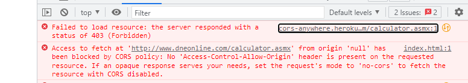

# assignment2-senbatuhan

Second assignment for Kofana Bootcamp

## About

This project gets some inputs from user and calculates them using the operation which you select with a SOAP service. All calculates, request to SOAP WSDL and response from service.
Also it has Eslint but just installed, no rule inside, ignore .js file now.
The code formatted with Prettier.

## API

[SOAP WSDL](http://www.dneonline.com/calculator.asmx?WSDL)

## Important

When you used it first time, you can get this error

to Handle with CORS, you have to click upper line and request a temporariy server from cors-anywhere.
